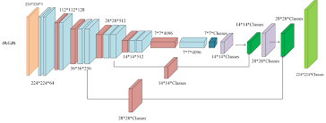

# fcn-liver-segmentation

## FCN Biomedical Image Semantic Segmentation

This repository contains the code to perform liver segmentation using Fully Convolutional Networks [FCN](https://arxiv.org/abs/1411.4038) and tensorflow.

  

## Data

The data are 2D medical image obtained from an abdominal CT-scan. Image processing from dicom to numpy, including HU and pixels normalization could be found at [this](https://github.com/vincentzossou/abdo-ctscan-processing) repository. Data can be download [here](https://drive.google.com/drive/folders/1PNAv7LGjPhw3cStAgAzbTUzuYodCcEmb?usp=sharing) and put in the data folder. The 4 phases of an abdominal scanner are used.  

## Dependencies

- Python 3.10
- Tensorflow 2.7.0
- Keras 2.7.0
  

Run train.py
